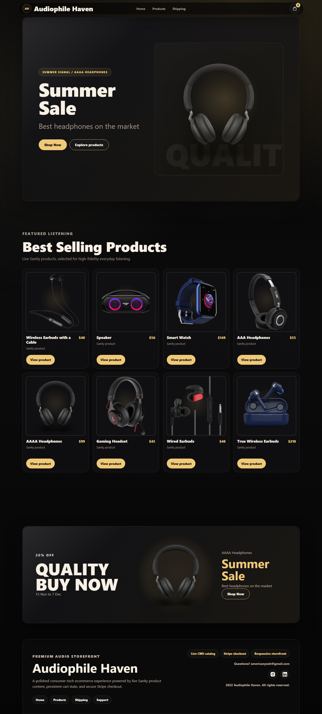
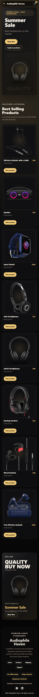
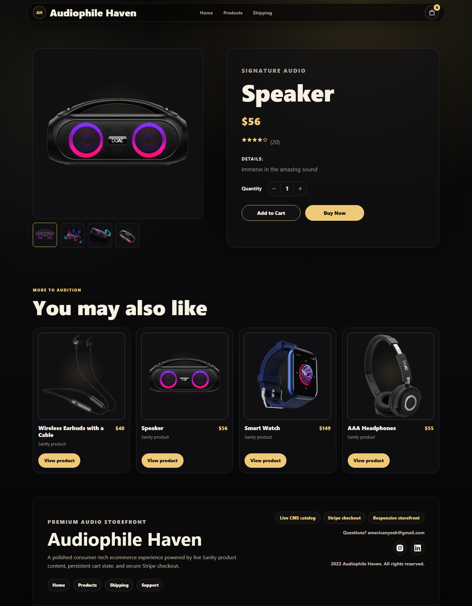
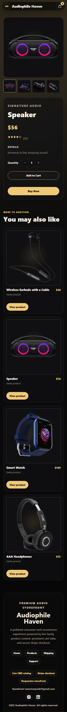
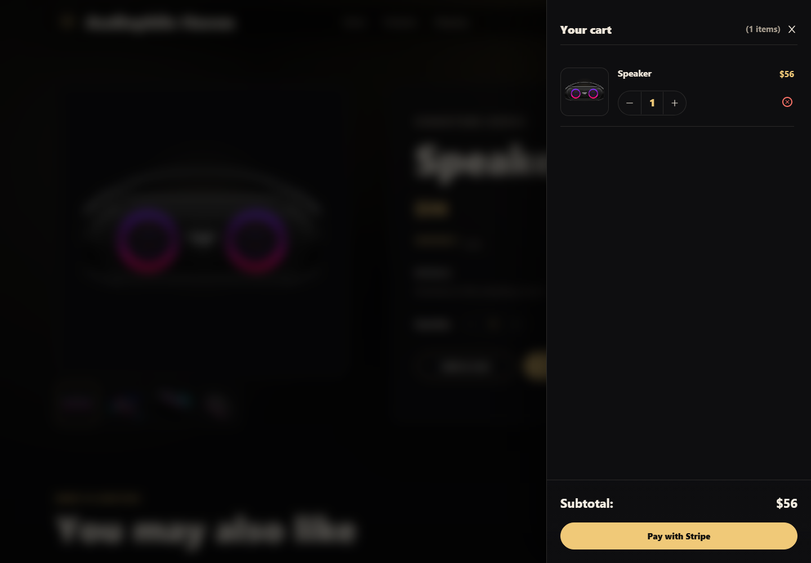
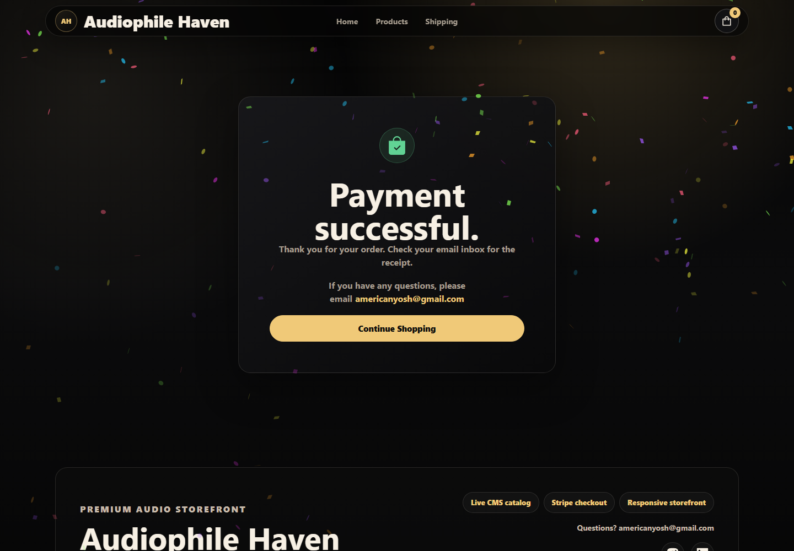

# Audiophile Haven

A dark-luxury ecommerce storefront for premium audio gear, built with Next.js, Sanity, React Context, Stripe Checkout, and Playwright browser testing.

Audiophile Haven is a portfolio-focused frontend redesign that keeps the original commerce functionality intact: live CMS products, dynamic product pages, cart state, Stripe Checkout, and checkout success handling. The UI is now shaped around a Figma-led dark consumer-tech direction with large product imagery, metallic surfaces, sharp CTAs, and responsive layouts.

Live site: https://ecommerce-project-xhu1-git-main-bbfosho0s-projects.vercel.app/

## Screenshots

The storefront is documented with tracked Playwright captures so reviewers can quickly scan the completed ecommerce flow. Desktop screenshots are shown full-width for detail, while mobile captures are intentionally constrained so GitHub does not stretch the README layout.

### Homepage

**Desktop storefront**  
Dark luxury landing experience with live Sanity banner content, responsive product cards, promotional content, and the rebuilt storefront footer.

<p align="center">
  
</p>

**Mobile storefront**  
The same commerce flow optimized for narrow screens with preserved CTAs, product browsing, and cart access.

<p align="center">
  
</p>

### Product Experience

**Product detail - desktop**  
Dynamic Sanity product route with gallery, product details, quantity controls, related products, and cart actions.

<p align="center">
  
</p>

**Product detail - mobile**  
Gallery-first purchase experience with the same cart behavior preserved on mobile.

<p align="center">
  
</p>

### Cart and Confirmation

**Cart drawer**  
Slide-out cart with live item state, quantity controls, subtotal, and Stripe checkout CTA.

<p align="center">
  
</p>

**Checkout success**  
Confirmation route that resets cart state and gives users a clean path back to shopping.

<p align="center">
  
</p>

## Highlights

- Figma-informed dark luxury storefront with polished homepage, promo banner, professional footer, product cards, product detail pages, cart drawer, and success page.
- Live Sanity CMS product and banner content; no hardcoded product catalog.
- Dynamic product routes generated from Sanity slugs with `fallback: 'blocking'`.
- React Context cart drawer with add, remove, increment, decrement, subtotal, empty state, and checkout loading behavior.
- Stripe Checkout session creation through a Next.js API route.
- Browser-safe Sanity image URL builder separated from the server data client to avoid exposing CMS tokens in the browser bundle.
- Local Playwright setup for repeatable browser smoke testing.

## Tech Stack

- Next.js 12 Pages Router
- React 17
- Sanity CMS
- Stripe Checkout
- React Context API
- React Hot Toast
- React Icons
- Playwright
- Global CSS design tokens and responsive layout systems

## Core Flow

1. `/` fetches live Sanity banner and product data.
2. Product cards link to `/product/[slug]`.
3. Product detail pages support gallery selection, quantity changes, Add to Cart, and Buy Now.
4. The cart drawer preserves real cart contents, subtotal, item controls, empty state, and checkout redirect.
5. `/success` resets cart state, runs confirmation effects, and links back to the storefront.

## Project Structure

```text
components/          Shared storefront, product, cart, navbar, and footer UI
context/             React cart state and cart actions
lib/                 Sanity client, browser-safe image builder, Stripe loader, effects
pages/               Next.js routes and Stripe API route
sanity_ecommerce/    Sanity schemas
styles/              Global dark-luxury design system and responsive UI styles
tests/e2e/           Playwright smoke tests
```

## Local Development

Install dependencies:

```bash
npm install
```

Run the app:

```bash
npm run dev
```

Open:

```text
http://localhost:3000
```

Use port `3002` if `3000` is already busy:

```bash
npm run dev -- -p 3002
```

## Playwright

This repo includes local Playwright tooling. Install the Chromium browser once after dependency install:

```bash
npx playwright install chromium
```

Run the smoke suite:

```bash
npm run test:e2e
```

Useful variants:

```bash
npm run test:e2e:headed
npm run test:e2e:ui
```

The test suite starts or reuses the local Next.js dev server at `http://localhost:3002`.

## Validation

```bash
npm run lint
npm run build
npm run test:e2e
```

The current smoke test covers homepage rendering, product navigation, product detail rendering, gallery interaction, quantity changes, Add to Cart, cart open/remove/empty state, and checkout success rendering.

## Environment Variables

```text
SANITY_API_TOKEN=
NEXT_PUBLIC_STRIPE_PUBLISHABLE_KEY=
NEXT_PUBLIC_STRIPE_SECRET_KEY=
```

`SANITY_API_TOKEN` is server-only and optional when the Sanity dataset is publicly readable. Product images use a browser-safe Sanity image client without a token.

The project declares Node `24.x` through `package.json` and `.nvmrc`; Vercel should also be configured to use Node `24.x` in Project Settings.

## Portfolio Notes

This project demonstrates a realistic frontend redesign process: preserve working business logic, use Figma as the visual source of truth, improve responsive UI and accessibility, remove avoidable browser token exposure, and add automated browser validation without migrating the app to a different architecture.

The latest polish pass tightened the first-viewport hero, rebuilt the promotional banner to prevent text/image collisions, replaced implementation-looking product detail copy with customer-facing language, and upgraded the footer into a complete storefront footer with navigation, support, trust notes, and social links.

## Future Improvements

- Rename the Stripe secret environment variable to a server-only name and update deployment settings.
- Replace raw `` tags with `next/image` after standardizing Sanity image dimensions and remote image config.
- Add a mocked Stripe checkout assertion for the final checkout button flow.
- Add loading and unavailable-product states for missing CMS data.
